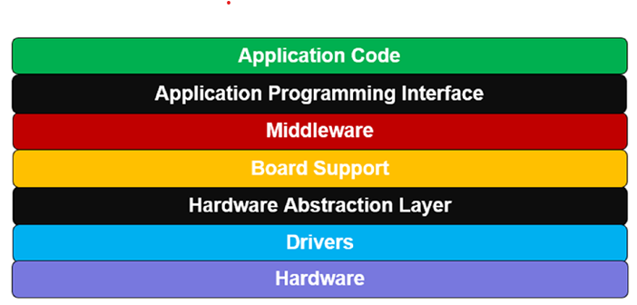

# 🧱 Capas de firmware embebido
En esta sección se presentan las capaz que son usualmente utilizadas en el diseño de Firmware orientado a sistemas embebidos.

## 🧩 Diferencia básica entre firmware y software
El firmware es un software diseñado específicamente para una pieza de hardware, mientras que el software no está diseñado específicamente para una pieza de hardware.

## 🧱 Capas
En primer lugar, es importante definir las capaz de firmware que se quieren emplear en el proyecto.

### 🧱 Capa de hardware
Esta capa se caracteriza por ser tal cual la capa física del hardware del microcontrolador (uC): periféricos, zonas de memoria y puertos GPIOs (por lo general).

### 🧱 Capa de drivers
En sistemas embebidos, los drivers se conocen cómo la forma de acceder al hardware físico del uC; en otras palabras, los registros de los periféricos, GPIO, entre otros.

- ⚡ [Capa de Drivers](./Capas/CapaDrivers.md)

### 🧱 Capa de Hardware Abstraction Layer (HAL)
Esta capa busca abstraer el acceso y ecritura a los registros, a través de funciones de firmware que se encarguen de configurar los periféricos del uC, en donde los parámetros de la propia función dan la pauta sobre la escritura que los registros deben tener. También, estas funciones pueden ser tan abstractas o tan específicas como se desee (depende de la aplicación que se le quiera dar).

Hasta este punto, solo se ha abordado el uC. A continuación se habla del hardware físico y externo al uC.

- ⚡ [Capa de funciones HAL](./Capas/CapaHAL.md)

### 🧱 Capa de Board Support
Esta capa se caracteriza por tener funciones que permiten el control, comunicación y/o monitoreo del hardware externo al uC:

* Focos LED.
* Push Botton.
* sensores.
* Actuadores.
* Transceptores.

- ⚡ [Capa de funciones para board support](./Capas/CapaBS.md)

### 🧱 Capa de Middleware
Esta capa generalmente tiene funciones de software que usualmente no buscan trabajar a nivel de registro ni contiene funciones de la capa de aplicación (de ahí su nombre); no obstante, el código de aplicación si depende de las funciones de esta capa. En otras palabras, esta capa se encarga de administrar actividades que son muy extensas para desarrollarse desde cero y que, independientemente del uC, estas funciones puedan operar. Entre el software que puede contener esta capa se encuentra:

* Sistemas Operativos en Tiempo Real (FreeRTOS, TinyOS, VxWorks, Micrium OS, Zephyr, entre otros).
* Pilas (stacks) de USB y/o Ethernet.
* Sistemas de archivos (FAT file system, SPIFFS, LittleFS, Yaffs, FileX, TSFS, por dar algunos ejemplos).

### 🧱 Capa de Application Programming Interface (API)
Esta capa contiene funciones, rutinas y librerias de Firmware orientadas a facilitar y acelearar el tiempo de desarrollo de una aplicación. Usualmente se hace uso de las funciones HAL y Board Support, en conjunto con algunas de Middleware, para desarrollar estas funciones.

- ⚡ [Capa de middleware y API](./Capas/CapaMiddleyAPI.md)

### 🧱 Capa de Application Code
La capa más alta de una arquitectura contiene todo el código necesario para que la aplicación final opere bajo los requerimientos y necesidades del proyecto. En este punto ya solo se utilizan funciones de la capa API y Middleware.
