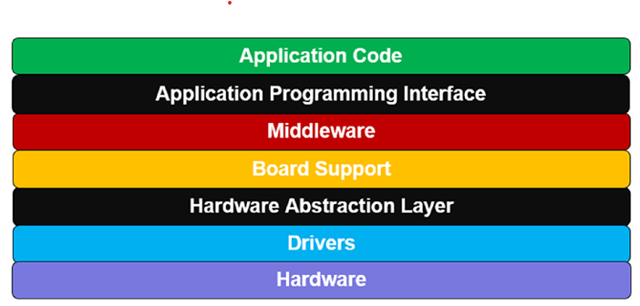

# 🧱 Capas de firmware embebido
En la actualidad, los sistemas embebidos han aumentado considerablemente su complejidad, provocando que los microcontroladores implementen periféricos y puertos más robustos que puedan dar abasto a las nuevas demandas. En consecuencia, el firmware se ha vuelto más complejo, al punto de tener que dividirlo en capas, las cuales se pueden omitir dependiendo de los objetivos y necesidades de cada proyecto.

## 🧩 Diferencia básica entre firmware y software
El firmware es todo aquel software que permite la configuración y comunicación directa con el hardware. En sistemas embebidos, el firmware está orientado principalmente a la lectura y escritura a nivel de registros de los diferentes periféricos y puertos de entrada y/o salida de un MCU, a fin de desempeñar tareas muy concretas. En contraste, el software de uso cotidiano suele ser administrado por sistemas operativos (en la mayoría de casos de propósito general), por lo cual no suelen tener una interacción directa con el hardware, sino que el sistema operativo se encarga de ello, desencadenando en programas con altos niveles de abstracción.

## 🧱 Capas
En primer lugar, es importante definir las capaz de firmware que se quieren emplear en el proyecto. En la siguielnte figura se muestran las capas usuales con las que puede contar un proyecto de firmware para sistemas embebidos, las cuales se desarrollan a continuación.

### 🧱 Capa de hardware
La capa Hardware representa al hardware físico de un microcontrolador, es decir, los registros con los cuales se configuran los diferentes periféricos.

### 🧱 Capa de drivers
La capa Drivers, representa la forma de acceder a los registros físicos desde el programa, ya sea a través de estructuras, acceso directo o por arreglos; conociendo únicamente su dirección en memoria.

- ⚡ [Capa de Drivers](./Capas/CapaDrivers.md)

### 🧱 Capa de Hardware Abstraction Layer (HAL)
La capa Hardware abstraction layer (HAL) busca abstraer el acceso a la capa de Drivers mediante funciones que se encargan de abstraer los procesos de configuración completos de cada modo de operación, así como de la escritura y lectura en los registros de los periféricos y puertos de un microcontrolador. De acuerdo al nivel de abstracción, se puede obtener una función que configuré a todo el periférico o varias funciones orientadas a diferentes modos de operación.

- ⚡ [Capa de funciones HAL](./Capas/CapaHAL.md)

### 🧱 Capa de Board Support
La capa Board support contempla sensores y actuadores externos al microcontrolador, los cuales pueden ser controlados por periféricos y puertos. Sin embargo, esta capa suele usarse cuando el hardware externo requiere de una comunicación más avanzada (por ejemplo, secuencias específicas de arranque o tramas). De este modo, se generan funciones a partir de la capa HAL e incluso la de Drivers.
- ⚡ [Capa de funciones para board support](./Capas/CapaBS.md)

### 🧱 Capa de Middleware
La capa Middleware funciona como un administrador de actividades que son muy extensas para desarrollarse a nivel de registros, pero que no realizan una aplicación específica. De este modo, suelen ser funciones que supervisan, administran o sincronizan el correcto funcionamiento de tareas concretas. Asimismo, esta capa suele ser casi independiente del microcontrolador, por lo cual es muy fácil de portar a otros dispositivos con características similares. Entre el software que puede contener esta capa se encuentra:
  * Sistemas Operativos en Tiempo Real (FreeRTOS, TinyOS, VxWorks, Micrium OS, Zephyr, entre otros).
  * Pilas (stacks) de USB y/o Ethernet.
  * Sistemas de archivos (FAT file system, SPIFFS, LittleFS, Yaffs, FileX, TSFS, por dar algunos ejemplos).

### 🧱 Capa de Application Programming Interface (API)
Esta capa contiene funciones, rutinas y librerías de Firmware orientadas a facilitar y acelerar el tiempo de desarrollo de una aplicación. Usualmente se hace uso de las funciones HAL y Board Support, en conjunto con algunas de Middleware, para desarrollar estas funciones.

- ⚡ [Capa de middleware y API](./Capas/CapaMiddleyAPI.md)

### 🧱 Capa de Application Code
La capa Application code representa todo el código que fue diseñado bajo los requerimientos iniciales del proyecto, utilizando principalmente funciones API y de Middleware (si se implementaron).

