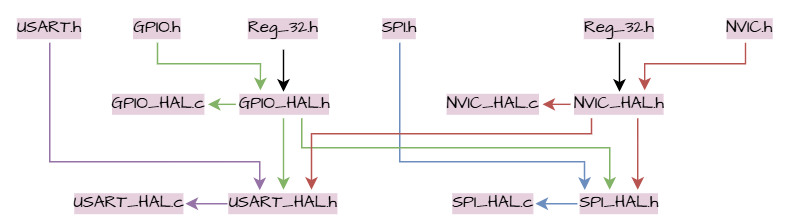
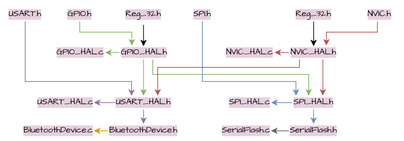
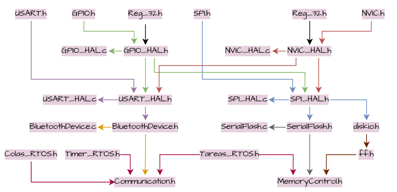
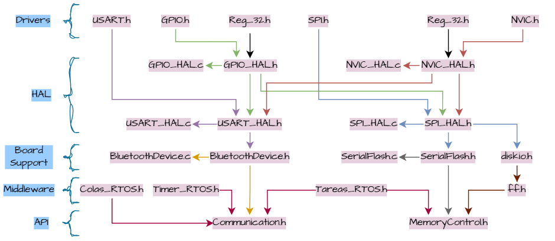

# 🗂️ Organización archivos
En esta sección se presenta una organización de archivos explicada a través de las capas de firmware y software embebidos. Se recomienda leer primero ese capítulo y luego esté.

## 🗂️ ¿Cómo organizar los archivos?
Para explicar estó, vamos a suponer que tenemos los siguientes archivos:

* Un archivo de cabecera ***Reg_32.h*** de la capa de drivers, en donde se tiene el acceso a registros a través de las funciones definidas con Reg32.

* Archivos de la capa de Drivers, en donde se tienen las estructuras de acceso a registros y de configuración de los periféricos(con o sin el uso de bit-field), ádemas de las enumeraciones para reemplazar números mágicos. Cómo ejemplos se pueden definir archivos para: ***GPIO.h***, ***NVIC.h***, ***SPI.h*** y ***USART.h***.

* Archivos de la capa HAL, con los nombres: ***GPIO_HAL.h***, ***NVIC_HAL.h***, ***SPI_HAL.h*** y ***USART_HAL.h***, los cuales contienen enumeraciones, estructuras a utilizar y las llamadas a función; además de sus archivos fuente ***GPIO_HAL.c***, ***NVIC_HAL.c***, ***SPI_HAL.h*** y ***USART_HAL.c***, los cuales contienen a las funciones en sí.

De este modo, los archivos se pueden llamar y ver de la siguiente manera:

En este caso, las funciones HAL para GPIO y la máquina de interrupciones NVIC (si es que se cuenta con una máquina específica aparte), son básicas para permitir la comunicación externa entre los periféricos como USART, SPI e I2C (por dar unos ejemplos); así como de permitir el uso de banderas de interrupción y utilizar sus ISR. Es por ello que se agregan a los periféricos USART y SPI de los ejemplos.

A partir de aquí, la capa de board support debe seguir una línealidad cómo se muestra a continuación:

No haría sentido tener archivos de periféricos I2C, CAN o ethernet para el manejo de un Módulo bluetooth HC-05, por dar un ejemplo. Si no se ocupa, no se debe agregar, ya que podría ocasionar errores si se llegarán a utilizar funciones que no se necesitan.

Continuando con el ejemplo, a partir de la capa de board support realmente se podrán observar que las capas pueden llegar a revolverse un poco, debido a la prescencia de los archivos de un RTOS y otros tantos que se lleguen a necesitar. Al final se podría ver algo como:

En cuestión de capas, se vería así:

