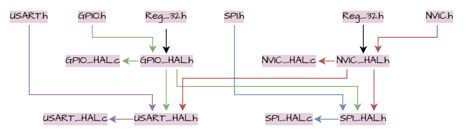
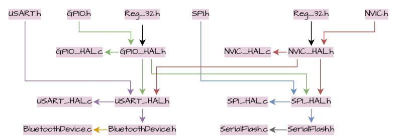
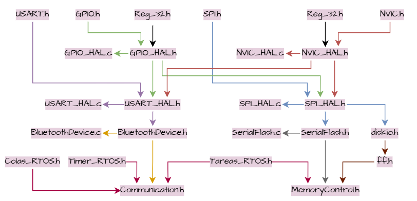
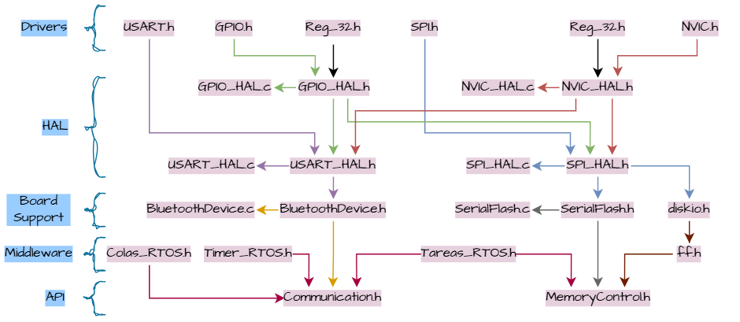

# 🗂️ Organización archivos
A partir de las capas de firmware se puede abordar la organización de los archivos, en donde se pueden ordenar varios archivos por capas, así como utilizar conceptos de POO (herencia y atributos de objetos), los cuales le dan otro significado a los archivos, más allá de contener funciones. De este modo, un archivo se puede visualizar como una clase, a partir de la cual solo la inclusión de esta en otro archivo le permite heredar los atributos y métodos de la misma (variables y punteros globales, enumeraciones, estructuras y funciones), además de servir como indicativo de que solo ese archivo heredado puede ser ocupado en el nuevo archivo. Esto permite que la división de capas se haga con más facilidad.

## 🗂️ ¿Cómo organizar los archivos?
Para explicar ésto, vamos a suponer que tenemos los siguientes archivos:

* Un archivo de cabecera ***Reg_32.h*** de la capa de drivers, en donde se tiene el acceso a registros a través de las funciones definidas con Reg32.

* Archivos de la capa de Drivers, en donde se tienen las estructuras de acceso a registros y de configuración de los periféricos(con o sin el uso de bit-field), además de las enumeraciones para reemplazar números mágicos. Cómo ejemplos se pueden definir archivos para: ***GPIO.h***, ***NVIC.h***, ***SPI.h*** y ***USART.h***.

* Archivos de la capa HAL, con los nombres: ***GPIO_HAL.h***, ***NVIC_HAL.h***, ***SPI_HAL.h*** y ***USART_HAL.h***, los cuales contienen enumeraciones, estructuras a utilizar y las llamadas a función; además de sus archivos fuente ***GPIO_HAL.c***, ***NVIC_HAL.c***, ***SPI_HAL.h*** y ***USART_HAL.c***, los cuales contienen a las funciones en sí.

De este modo, los archivos se pueden llamar y ver de la siguiente manera:

En este caso, las funciones HAL para GPIO y la máquina de interrupciones NVIC (si es que se cuenta con una máquina específica aparte), son básicas para permitir la comunicación externa entre los periféricos como USART, SPI e I2C (por dar unos ejemplos); así como de permitir el uso de banderas de interrupción y utilizar sus ISR. Es por ello que se agregan a los periféricos USART y SPI de los ejemplos.

A partir de aquí, la capa de board support debe seguir una linealidad cómo se muestra a continuación:

No haría sentido tener archivos de periféricos I2C, CAN o ethernet para el manejo de un módulo bluetooth HC-05, por dar un ejemplo. Si no se ocupa, no se debe agregar, ya que podría ocasionar errores si se llegarán a utilizar funciones que no se necesitan. Esto va de la mano con el concepto de herencia, en donde cada archivo, ahora visto como un objeto, hereda atributos al ser incluido en otro archivo. La inclusión de este concepto permite a otros integrantes diferenciar cada capa y utilizar solo los archivos necesarios. 

Continuando con el ejemplo, a partir de la capa de board support realmente se podrá observar que las capas pueden llegar a revolverse un poco, debido a la prescencia de los archivos de un RTOS y otros tantos que se lleguen a necesitar. Al final se podría ver algo como:

En cuestión de capas, se vería así:

